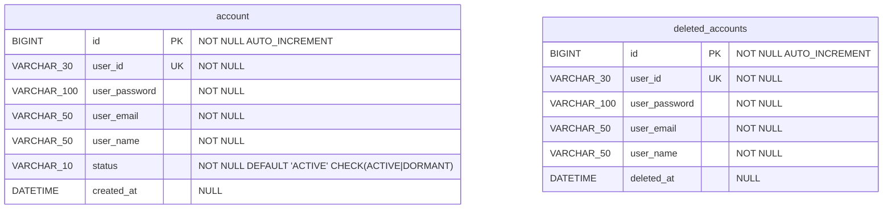
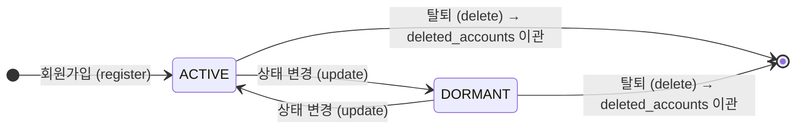
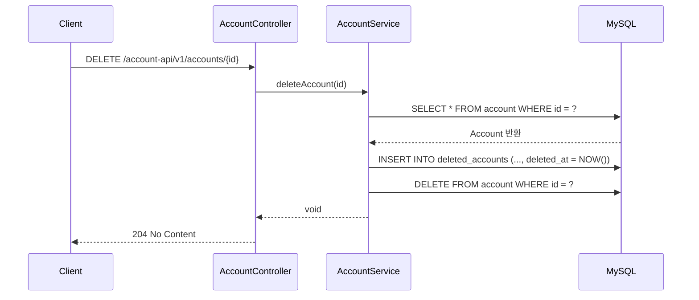

# miniDooray-AccountAPI ERD

## 엔티티 관계 다이어그램

> **관계 설명**: 물리적 FK 없음. 계정 삭제(DELETE) 시 `account` 레코드를 `deleted_accounts`로 복사 후 원본을 삭제하는 애플리케이션 레벨 로직으로 처리합니다.

---

## 테이블 상세

### account

| 컬럼명 | 데이터 타입 | NOT NULL | KEY | DEFAULT | 설명 |
|--------|------------|:--------:|-----|---------|------|
| id | BIGINT | ✅ | PK | AUTO_INCREMENT | 계정 고유 식별자 |
| user_id | VARCHAR(30) | ✅ | UK | — | 로그인 ID (중복 불가) |
| user_password | VARCHAR(100) | ✅ | — | — | BCrypt 인코딩된 비밀번호 |
| user_email | VARCHAR(50) | ✅ | — | — | 이메일 주소 |
| user_name | VARCHAR(50) | ✅ | — | — | 사용자 표시 이름 |
| status | VARCHAR(10) | ✅ | — | `ACTIVE` | 계정 상태 (CHECK 제약) |
| created_at | DATETIME | — | — | — | 계정 생성일시 |

**제약 조건**
- `uk_account_user_id` : UNIQUE (user_id)
- `chk_account_status` : CHECK (status IN ('ACTIVE', 'DORMANT'))

---

### deleted_accounts

| 컬럼명 | 데이터 타입 | NOT NULL | KEY | DEFAULT | 설명 |
|--------|------------|:--------:|-----|---------|------|
| id | BIGINT | ✅ | PK | AUTO_INCREMENT | 이력 고유 식별자 |
| user_id | VARCHAR(30) | ✅ | UK | — | 탈퇴한 계정의 로그인 ID |
| user_password | VARCHAR(100) | ✅ | — | — | 탈퇴 시점의 비밀번호 |
| user_email | VARCHAR(50) | ✅ | — | — | 탈퇴 시점의 이메일 |
| user_name | VARCHAR(50) | ✅ | — | — | 탈퇴 시점의 이름 |
| deleted_at | DATETIME | — | — | — | 탈퇴일시 |

**제약 조건**
- `uk_deleted_accounts_user_id` : UNIQUE (user_id)

---

## 계정 상태 흐름

---

## 계정 삭제 흐름

