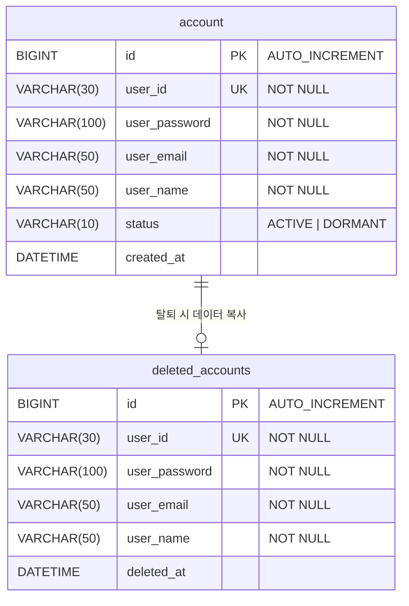
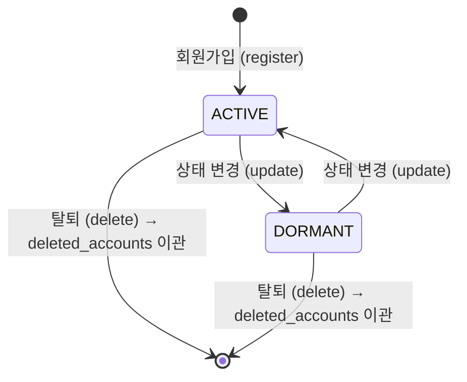

# miniDooray-AccountAPI ERD

## 다이어그램



> **관계 설명**: `account` → `deleted_accounts` 는 물리적 FK 없이 논리적 참조입니다.  
> 계정 삭제(DELETE) 시 `account` 레코드를 `deleted_accounts` 로 복사한 뒤 원본을 삭제합니다.

---

## 테이블 상세

### account

계정의 주 테이블입니다. 활성 계정 및 휴면 계정 정보를 관리합니다.

| 컬럼명 | 데이터 타입 | NULL | KEY | 기본값 | 설명 |
|--------|------------|------|-----|--------|------|
| id | BIGINT | NOT NULL | PK | AUTO_INCREMENT | 계정 고유 번호 |
| user_id | VARCHAR(30) | NOT NULL | UQ | - | 로그인 ID (중복 불가) |
| user_password | VARCHAR(100) | NOT NULL | - | - | 암호화된 비밀번호 |
| user_email | VARCHAR(50) | NOT NULL | - | - | 이메일 (형식 검증) |
| user_name | VARCHAR(50) | NOT NULL | - | - | 사용자 이름 |
| status | VARCHAR(10) | NOT NULL | - | `ACTIVE` | 계정 상태 |
| created_at | DATETIME | NULL | - | - | 계정 생성일시 |

#### status 값

| 값 | 설명 |
|----|------|
| `ACTIVE` | 정상 활성 계정 |
| `DORMANT` | 휴면 계정 |

---

### deleted_accounts

탈퇴한 계정의 이력 보관 테이블입니다. `account` 삭제 시 데이터를 복사하여 보관합니다.

| 컬럼명 | 데이터 타입 | NULL | KEY | 기본값 | 설명 |
|--------|------------|------|-----|--------|------|
| id | BIGINT | NOT NULL | PK | AUTO_INCREMENT | 이력 고유 번호 |
| user_id | VARCHAR(30) | NOT NULL | UQ | - | 탈퇴한 계정의 로그인 ID |
| user_password | VARCHAR(100) | NOT NULL | - | - | 탈퇴 시점의 비밀번호 |
| user_email | VARCHAR(50) | NOT NULL | - | - | 탈퇴 시점의 이메일 |
| user_name | VARCHAR(50) | NOT NULL | - | - | 탈퇴 시점의 이름 |
| deleted_at | DATETIME | NULL | - | - | 탈퇴일시 |

---

## 계정 상태 흐름



---

## 계정 삭제 흐름

```
DELETE /account-api/v1/accounts/{id}

1. account 테이블에서 대상 계정 조회
2. deleted_accounts 테이블에 계정 정보 INSERT (deleted_at = 현재 시각)
3. account 테이블에서 해당 레코드 DELETE
```